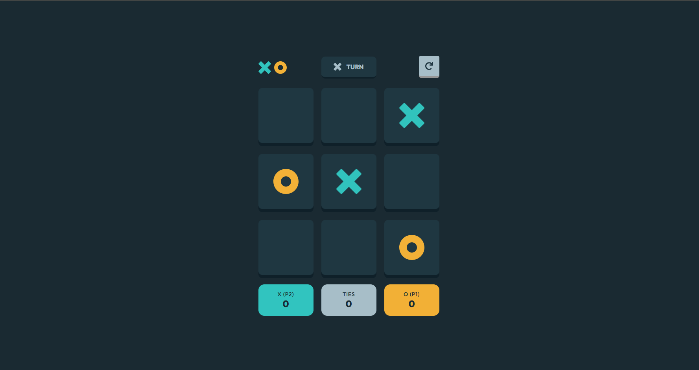

# Frontend Mentor - Tic Tac Toe solution

This is a solution to the [Tic Tac Toe challenge on Frontend Mentor](https://www.frontendmentor.io/challenges/tic-tac-toe-game-Re7ZF_E2v). Frontend Mentor challenges help you improve your coding skills by building realistic projects. 

## Table of contents

- [Overview](#overview)
  - [The challenge](#the-challenge)
  - [Screenshot](#screenshot)
  - [Links](#links)
- [My process](#my-process)
  - [Built with](#built-with)
  - [What I learned](#what-i-learned)
  - [Continued development](#continued-development)
  - [Useful resources](#useful-resources)
- [Author](#author)

## Overview

### The challenge

Users should be able to:

- View the optimal layout for the game depending on their device's screen size
- See hover states for all interactive elements on the page
- Play the game either solo vs the computer or multiplayer against another person
- **Bonus 1**: Save the game state in the browser so that it’s preserved if the player refreshes their browser
- **Bonus 2**: Instead of having the computer randomly make their moves, try making it clever so it’s proactive in blocking your moves and trying to win

### Screenshot



### Links

- Solution URL: [https://tic-tac-toe-acs.netlify.app/](https://tic-tac-toe-acs.netlify.app/)
- Live Site URL: [https://tic-tac-toe-acs.netlify.app/](https://tic-tac-toe-acs.netlify.app/)

## My process

### Built with

- Semantic HTML5 markup
- CSS custom properties
- Flexbox
- CSS Grid
- Mobile-first workflow
- [React](https://reactjs.org/) - JS library
- [Emotion](https://emotion.sh/docs/introduction) - For styles

### What I learned

A good opportunity to practice OOP and some alogorithms for intelligently choosing moves.


```js
class AIPlayer extends Player {
	constructor(name, symbol) {
		super(name, symbol, true);
	}

	makeMove(board) {
		const position = this.chooseBestMove(board);
		return board.placeMark(position, this.symbol);
	}

	chooseBestMove(board) {
		const aiSymbol = this.symbol;
		const humanSymbol = aiSymbol === 'X' ? 'O' : 'X';
		let bestScore = -Infinity;
		let move = -1;
		for (let i = 0; i < board.grid.length; i++) {
			if (board.isEmpty(i)) {
				board.grid[i] = aiSymbol;
				let score = this.minimax(board, 0, false, aiSymbol, humanSymbol);
				board.grid[i] = null;
				if (score > bestScore) {
					bestScore = score;
					move = i;
				}
			}
		}
		return move;
	}

	minimax(board, depth, isMaximizing, aiSymbol, humanSymbol) {
		if (board.checkWin(aiSymbol)) return 10 - depth;
		if (board.checkWin(humanSymbol)) return depth - 10;
		if (board.isFull()) return 0;

		if (isMaximizing) {
			let bestScore = -Infinity;
			for (let i = 0; i < board.grid.length; i++) {
				if (board.isEmpty(i)) {
					board.grid[i] = aiSymbol;
					let score = this.minimax(board, depth + 1, false, aiSymbol, humanSymbol);
					board.grid[i] = null;
					bestScore = Math.max(score, bestScore);
				}
			}
			return bestScore;
		} else {
			let bestScore = Infinity;
			for (let i = 0; i < board.grid.length; i++) {
				if (board.isEmpty(i)) {
					board.grid[i] = humanSymbol;
					let score = this.minimax(board, depth + 1, true, aiSymbol, humanSymbol);
					board.grid[i] = null;
					bestScore = Math.min(score, bestScore);
				}
			}
			return bestScore;
		}
	}
}
```

### Continued development

In the near future - plan to make it fullstack and multiplayer i.e on different devices.

### Useful resources

- [CSS FOR JS](https://courses.joshwcomeau.com/css-for-js)
- [UI.DEV](https://ui.dev/c/react)


## Author

- Frontend Mentor - [@AcharaChisomSolomon](https://www.frontendmentor.io/profile/AcharaChisomSolomon)
- Twitter - [@Chisom14Solomon](https://www.twitter.com/Chisom14Solomon/highlights)